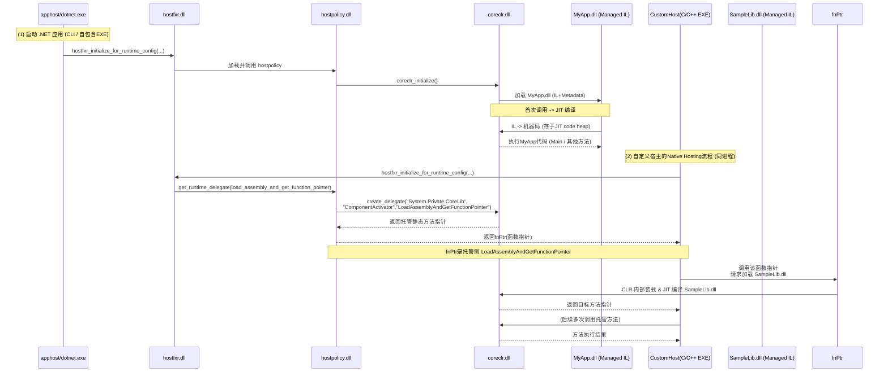
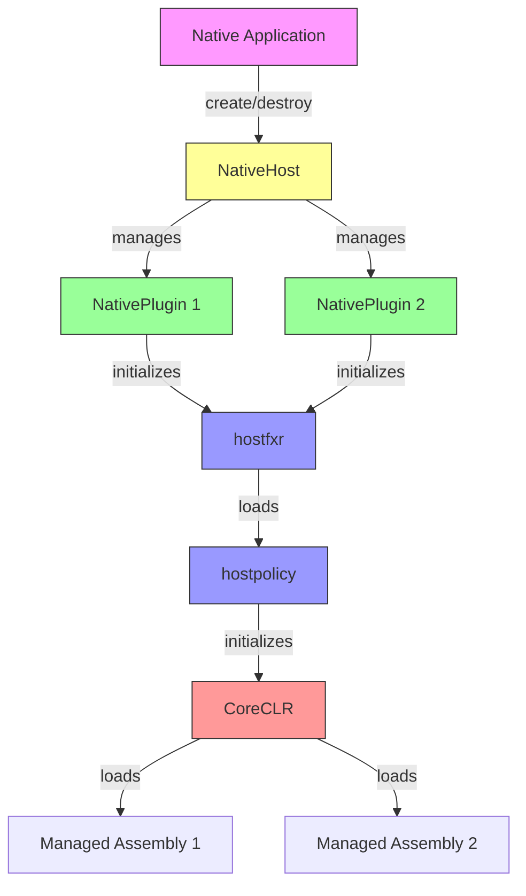

# 使用 .NET Native Hosting 构建 AOT 环境下的 .NET 扩展程序

本文档从应用程序（.NET）的编译、运行切入，系统地介绍了 .net native hosting 技术如何通过一系列组件（如 `apphost`, `hostfxr`, `hostpolicy`, `coreclr`）的协作来达到自定义执行托管程序集，同时也概括了 JIT 与 AOT 场景下的异同及关键原理。文档后半部分也对托管类型在 CLR 内部的表示方式（MethodTable / TypeHandle）做了概括性说明。概述：从启动到执行

一个 .NET 应用程序（无论是命令行 `dotnet MyApp.dll`，还是自包含 EXE，或自定义 Native Hosting）在启动时，会先由**宿主**进程/可执行载入，再通过 `.NET Hosting` 相关的原生库（hostfxr / hostpolicy）协调加载 `.NET Runtime`（coreclr），最后再把我们的托管程序集（.NET Assembly）载入并执行。

在典型的 .NET 6+ 单文件或自包含部署里，一些组件会被打包到同一个可执行文件中，流程本质类似，但物理文件整合在一起。

## 关键组件与角色

### apphost

- **apphost** 是一种生成好的原生启动器（exe），由 .NET SDK 在发布阶段生成。
- 当你发布自包含的 .NET 应用程序（`dotnet publish -r <rid> -p:PublishSingleFile=true`）时，SDK 会把 `hostfxr`、`hostpolicy` 等打包进最终的单文件 exe（这也是"apphost"）。用户双击该 exe，就相当于先启动了原生主程序，再进入到后续的 .NET runtime 初始化流程。

### hostfxr

- **hostfxr**（如 `hostfxr.dll` / `.so`）是最外层的 Hosting API 库，它负责：

  1. **解析** 应用的 `.runtimeconfig.json`、.NET 版本、依赖信息；
  2. **定位并加载** `hostpolicy`；
  3. 向外暴露一组"Native Hosting API"（如 `hostfxr_initialize_for_runtime_config`、`hostfxr_get_runtime_delegate`），方便自定义宿主调用。

- 在"命令行执行"场景里，是 `dotnet.exe` 先加载 `hostfxr` 并调用其初始化逻辑。

### hostpolicy

- **hostpolicy**（如 `hostpolicy.dll` / `.so`）是宿主策略库，它承接 `hostfxr` 的调用，进一步负责：
  - 读取并处理 **依赖解析**（依赖 `.deps.json` 里的信息）
  - **启动 coreclr**：加载并初始化 .NET runtime
  - 暴露出若干内部枚举和接口（如 `coreclr_delegate_type`）给 `hostfxr` 及上层宿主用，用于获取特定的 runtime 委托（delegate）
- 在源代码层面可见 [hostpolicy.cpp](https://github.com/dotnet/runtime/blob/main/src/native/corehost/hostpolicy/hostpolicy.cpp) 展示了它如何处理不同类型的 delegate 请求，如 `load_assembly_and_get_function_pointer`。

### coreclr

- **coreclr**（如 `coreclr.dll` / `.so`）是 .NET 的真正运行时引擎，包含 **JIT**、**GC**、**类型系统**、**线程管理** 等。
- 对宿主层暴露一些 API（例如 `ICLRRuntimeHost2::CreateDelegate`）来动态获取托管方法的原生调用入口点，或执行托管程序集的 `Main` 方法。
- 在 .NET 5+ 统一 branding 下，也称 `.NET runtime`。底层仍是 CoreCLR。

### managed assembly

- **托管程序集**（.dll / .exe）指我们用 C# 或其他 .NET 语言编译出的 IL+元数据文件。
- 最终在 .NET runtime（coreclr）下 JIT 或 AOT 执行。

## 应用程序生命周期：启动流程与模块协作

下面以 **JIT 场景** 的 .NET 应用为例（最常见）：

1. **用户启动应用**（双击 EXE 或命令行 `dotnet MyApp.dll`）
2. **apphost / dotnet.exe 加载 `hostfxr`**
   - `hostfxr` 读取 `.runtimeconfig.json`，确定 .NET 版本和路径
   - 加载 `hostpolicy` 并调用其初始化接口
3. **hostpolicy 初始化并解析依赖**
   - 读取 `.deps.json` 信息，确定要加载的托管程序集列表和 probing 路径
   - `hostpolicy` 加载并初始化 `coreclr`
4. **coreclr 启动，加载入口程序集**
   - 根据托管程序集的 `Main()`（或宿主指定的方法指针）开始执行
   - 当方法第一次被调用时，JIT 编译 IL 到机器码
5. **运行时执行**
   - .NET 应用逻辑开始运行，CLR 管理 GC、异常处理等，直至进程退出。

**主线思路**就是：宿主(原生进程) -> `hostfxr` -> `hostpolicy` -> `coreclr` -> 加载并执行 managed assembly。

```mermaid
flowchart TB
    A([apphost / dotnet.exe])
    B([hostfxr.dll])
    C([hostpolicy.dll])
    D([coreclr.dll])
    E([Managed_Assembly])

    style A fill:#fff,stroke:#777,stroke-width:1px,color:#333
    style B fill:#fff,stroke:#777,stroke-width:1px,color:#333
    style C fill:#fff,stroke:#777,stroke-width:1px,color:#333
    style D fill:#fff,stroke:#777,stroke-width:1px,color:#333
    style E fill:#fff,stroke:#777,stroke-width:1px,color:#333

    A:::host
    B:::host
    C:::host
    D:::runtime
    E:::managed

    classDef host fill:#e6ffee,stroke:#028482,color:#000
    classDef runtime fill:#fff2e6,stroke:#c66b12,color:#000
    classDef managed fill:#e7e9ff,stroke:#4e58b2,color:#000

    subgraph "启动流程"
      A -->|Initialize config<br/>parse .runtimeconfig.json| B
      B -->|Load & call hostpolicy| C
      C -->|Initialize .NET Runtime<br/>parse .deps.json| D
      D -->|Load & JIT<br/>Managed IL| E
    end

```





## Native Hosting 与 `create_delegate`

### `load_assembly_and_get_function_pointer` 简述

在"自定义宿主"场景里（也称 **Native Hosting**），我们可能直接用 C/C++ 自己写一个 EXE，然后调用 `hostfxr` API 来手动控制 runtime。流程通常是：

1. **调用 `hostfxr_initialize_for_runtime_config`**
   - 传递 `.runtimeconfig.json` 或者手动提供 runtime 目录信息。
2. **获取指定类型的委托**（枚举类型 `coreclr_delegate_type`）
   - 例如 `load_assembly_and_get_function_pointer`：
     ```cpp
     // hostpolicy.cpp 的对应逻辑
     case coreclr_delegate_type::load_assembly_and_get_function_pointer:
         return coreclr->create_delegate(
             "System.Private.CoreLib",
             "Internal.Runtime.InteropServices.ComponentActivator",
             "LoadAssemblyAndGetFunctionPointer",
             delegate);
     ```
   - 这里 `create_delegate` 会拿到托管方法 `ComponentActivator.LoadAssemblyAndGetFunctionPointer` 的原生函数指针。
3. **调用该函数指针**
   - 这个托管方法内负责加载指定的 .NET assembly 并获取其中某个方法指针，再返回给原生层。
   - 整个过程保持在**同一个进程**中，CoreCLR 与原生宿主通过函数指针互操作。

**核心**：`hostpolicy` 并没有直接调用 CLR 内部私有 API 去加载程序集，而是通过托管公共入口点（`System.Private.CoreLib` 内的静态方法）来实现。这样保持了模块分层清晰和可维护性。

## 托管代码执行机制：JIT & AOT

### JIT (Just-In-Time)

- **编译时**：托管程序集以 IL+元数据形式存在。
- **运行时**：当方法第一次调用时，CoreCLR 内部的 JIT 编译器把 IL 转成机器码，存入内存中的"JIT code heap"。
- **调用约定统一**：CoreCLR 的 C++ 原生代码与 JIT 生成的机器码在同一进程内协同，通过函数指针和共享的 runtime 数据结构（MethodDesc, MethodTable 等）进行交互。

### AOT (Ahead-Of-Time)

- 在编译/发布阶段，就将 IL 编译成原生机器码，可能与 `.NET runtime` 一起打包进一个可执行或库文件中。
- 运行时不再需要 JIT，但仍然需要 CLR 的 GC、类型系统、异常处理等服务。
- **NativeAOT** 或 **ReadyToRun**（Crossgen2）等方案，都属于 AOT 的具体实现方式。
- **相同点**：最终还是在同一个 runtime 环境中执行（只是不再即时编译 IL）。


## Native Plugin Host 实现详解

### 架构概览

在我们的实现中，主要包含以下几个核心组件：

1. **NativeHost**：顶层宿主管理器
   - 管理多个插件实例的生命周期
   - 提供插件的创建、查找和销毁功能
   - 通过不透明句柄（opaque handle）维护插件映射关系

2. **NativePlugin**：单个插件实例
   - 封装单个 .NET 运行时实例
   - 管理 hostfxr 相关的函数指针
   - 处理程序集加载和方法调用

3. **原生 API 层**：C 接口
   - 提供跨平台的 C API
   - 处理错误码和状态管理
   - 实现资源的安全释放

### 组件关系图



### NativeHost 详解

`NativeHost` 类是整个插件系统的核心管理器，它与前文提到的 .NET hosting 组件的关系如下：

1. **与 apphost 的关系**
   - 不同于 apphost 作为启动器，`NativeHost` 是一个库形式的宿主
   - 允许现有原生应用程序动态加载 .NET 功能

2. **与 hostfxr 的交互**
   - 通过 `NativePlugin` 实例初始化 hostfxr
   - 获取并保存关键的运行时函数指针
   - 管理 hostfxr 的生命周期

3. **内部实现**
```cpp
class NativeHost {
    // 插件实例映射表
    std::unordered_map<native_plugin_handle_t, std::unique_ptr<NativePlugin>> plugins;
    
    // 插件管理方法
    NativePlugin* get_plugin(native_plugin_handle_t handle);
    native_plugin_handle_t add_plugin(std::unique_ptr<NativePlugin> plugin);
    bool removePlugin(native_plugin_handle_t handle);
};
```

### NativePlugin 详解

`NativePlugin` 类代表单个 .NET 运行时实例，它负责：

1. **运行时初始化**
   - 加载 hostfxr 库
   - 初始化运行时配置
   - 获取程序集加载函数指针

2. **方法调用桥接**
   - 加载托管程序集
   - 获取特定方法的函数指针
   - 提供原生代码调用托管方法的能力

3. **内部实现**
```cpp
class NativePlugin {
    // 核心函数指针
    load_assembly_and_get_function_pointer_fn load_assembly_and_get_function_ptr;
    hostfxr_close_fn hostfxr_close_ptr;
    
    // 状态管理
    bool is_initialized;
};
```

### 错误处理机制

实现提供了细粒度的错误码系统：

```cpp
typedef enum {
    // 成功代码（0和正值）
    NATIVE_PLUGIN_HOST_SUCCESS = 0,

    // 宿主错误（-100到-199）
    NATIVE_PLUGIN_HOST_ERROR_HOST_NOT_FOUND = -100,

    // 插件错误（-200到-299）
    NATIVE_PLUGIN_HOST_ERROR_PLUGIN_NOT_FOUND = -200,
    
    // 运行时错误（-300到-399）
    NATIVE_PLUGIN_HOST_ERROR_RUNTIME_INIT = -300,
    
    // 程序集错误（-400到-499）
    NATIVE_PLUGIN_HOST_ERROR_ASSEMBLY_LOAD = -400,
    
    // 通用错误（-500到-599）
    NATIVE_PLUGIN_HOST_ERROR_INVALID_ARG = -500,
} NativePluginHostStatus;
```

### 托管侧 PluginHost 设计

`PluginHost` 类是 Native Plugin Host 的托管侧包装器，它提供了与原生 API 对应的托管方法：

1. **核心功能**
```csharp
public class PluginHost : IDisposable
{
    private IntPtr _handle;
    private IntPtr _pluginHandle;

    public PluginHost()
    {
        var result = NativeMethods.CreateHost(out _handle);
        if (result < 0)
        {
            ThrowForError(result, "Failed to create host instance");
        }
    }

    /// <summary>
    /// 加载插件
    /// </summary>
    /// <param name="runtimeConfigPath">运行时配置文件路径</param>
    /// <exception cref="ArgumentException">配置文件路径无效</exception>
    /// <exception cref="InvalidOperationException">运行时已初始化或其他运行时错误</exception>
    /// <exception cref="DllNotFoundException">找不到 hostfxr 库</exception>
    /// <exception cref="TypeInitializationException">运行时初始化失败</exception>
    public void LoadPlugin(string runtimeConfigPath)
    {
        if (string.IsNullOrEmpty(runtimeConfigPath))
        {
            throw new ArgumentException("Runtime config path cannot be null or empty", nameof(runtimeConfigPath));
        }

        var result = NativeMethods.LoadPlugin(_handle, runtimeConfigPath, out _pluginHandle);
        if (result < 0)
        {
            ThrowForError(result, runtimeConfigPath);
        }
    }

    /// <summary>
    /// 卸载插件
    /// </summary>
    public void UnloadPlugin()
    {
        if (_pluginHandle != IntPtr.Zero)
        {
            var result = NativeMethods.UnloadPlugin(_handle, _pluginHandle);
            if (result < 0)
            {
                ThrowForError(result, "Failed to unload plugin");
            }
            _pluginHandle = IntPtr.Zero;
        }
    }

    /// <summary>
    /// 获取函数委托
    /// </summary>
    /// <typeparam name="T">委托类型</typeparam>
    /// <param name="assemblyPath">程序集路径</param>
    /// <param name="typeName">类型名称</param>
    /// <param name="methodName">方法名称</param>
    /// <returns>函数委托</returns>
    public T GetFunction<T>(string assemblyPath, string typeName, string methodName) where T : Delegate
    {
        if (_pluginHandle == IntPtr.Zero)
        {
            throw new InvalidOperationException("Plugin is not loaded");
        }

        if (string.IsNullOrEmpty(assemblyPath))
            throw new ArgumentException("Assembly path cannot be null or empty", nameof(assemblyPath));
        if (string.IsNullOrEmpty(typeName))
            throw new ArgumentException("Type name cannot be null or empty", nameof(typeName));
        if (string.IsNullOrEmpty(methodName))
            throw new ArgumentException("Method name cannot be null or empty", nameof(methodName));

        var result = NativeMethods.GetFunctionPointer(
            _handle,
            _pluginHandle,
            assemblyPath,
            typeName,
            methodName,
            typeof(T).ToString(),
            out var functionPtr);

        if (result < 0)
        {
            ThrowForError(result, $"{assemblyPath}:{typeName}.{methodName}");
        }

        return Marshal.GetDelegateForFunctionPointer<T>(functionPtr);
    }

    protected virtual void Dispose(bool disposing)
    {
        if (!_isDisposed)
        {
            if (disposing)
            {
                UnloadPlugin();
            }

            if (_handle != IntPtr.Zero)
            {
                NativeMethods.DestroyHost(_handle);
                _handle = IntPtr.Zero;
            }

            _isDisposed = true;
        }
    }

    public void Dispose()
    {
        Dispose(true);
        GC.SuppressFinalize(this);
    }
}
```

2. **使用示例**
```csharp
// 创建宿主实例
using var host = new PluginHost();

// 加载插件
host.LoadPlugin("MyPlugin.runtimeconfig.json");

// 获取并调用托管方法
var calculate = host.GetFunction<Func<int, int, int>>(
    "MyPlugin.dll",
    "MyPlugin.Calculator",
    "Add"
);
int result = calculate(10, 20);

// 卸载插件
host.UnloadPlugin();
```

3. **错误处理**
```csharp
private static void ThrowForError(int errorCode, string context)
{
    switch (errorCode)
    {
        case NativeMethods.ErrorHostNotFound:
            throw new InvalidOperationException($"Host not found: {context}");
        case NativeMethods.ErrorPluginNotFound:
            throw new InvalidOperationException($"Plugin not found: {context}");
        case NativeMethods.ErrorPluginNotInitialized:
            throw new InvalidOperationException($"Plugin not initialized: {context}");
        case NativeMethods.ErrorRuntimeInit:
            throw new TypeInitializationException($"Runtime initialization failed: {context}", null);
        case NativeMethods.ErrorHostfxrNotFound:
            throw new DllNotFoundException($"hostfxr not found: {context}");
        case NativeMethods.ErrorAssemblyLoad:
            throw new BadImageFormatException($"Failed to load assembly: {context}");
        case NativeMethods.ErrorTypeLoad:
            throw new TypeLoadException($"Failed to load type: {context}");
        case NativeMethods.ErrorMethodLoad:
            throw new MissingMethodException($"Failed to load method: {context}");
        case NativeMethods.ErrorInvalidArg:
            throw new ArgumentException($"Invalid argument: {context}");
        default:
            throw new InvalidOperationException($"Unknown error {errorCode}: {context}");
    }
}
```

这种设计有以下优点：

1. **对称性**
   - 托管侧 API 与原生侧保持一致
   - 方法命名和行为统一
   - 错误处理机制对应

2. **资源管理**
   - 实现 `IDisposable` 接口
   - 自动清理原生资源
   - 支持 using 语句

3. **类型安全**
   - 使用泛型方法获取函数委托
   - 强类型的错误处理
   - 参数验证

4. **易用性**
   - 简单直观的 API 设计
   - 清晰的生命周期管理
   - 详细的异常信息

## PluginHost 使用指南

### 基本概念

`PluginHost` 是 Native Plugin Host 的托管侧包装器，它提供了一个简单直观的 API 来管理多个 .NET 插件。每个插件都有自己独立的运行时配置和生命周期。

### 插件生命周期

1. **创建宿主**
```csharp
// 创建宿主实例，它会负责管理所有插件
using var pluginHost = new PluginHost();
```

2. **加载插件**
```csharp
// 准备插件配置路径
var runtimeConfigPath = Path.Combine(baseDir, "MyPlugin.runtimeconfig.json");

// 加载插件并获取句柄
var pluginHandle = pluginHost.LoadPlugin(runtimeConfigPath);
Console.WriteLine($"Loaded plugin: {pluginHandle}");
```

3. **获取函数**
```csharp
// 定义委托类型
delegate int CalculationDelegate(int a, int b);

// 获取函数委托
var add = pluginHost.GetFunction<CalculationDelegate>(
    pluginHandle,          // 插件句柄
    "MyPlugin.dll",        // 程序集路径
    "MyPlugin.Calculator", // 类型名称
    "Add"                  // 方法名称
);

// 调用函数
int result = add(10, 20);
```

4. **卸载插件**
```csharp
// 当不再需要插件时，可以卸载它
pluginHost.UnloadPlugin(pluginHandle);
```

### 多插件管理示例

```csharp
using var pluginHost = new PluginHost();

try
{
    var baseDir = AppContext.BaseDirectory;
    
    // 加载计算器插件
    var calculatorConfig = Path.Combine(baseDir, "Calculator.runtimeconfig.json");
    var calculatorPlugin = pluginHost.LoadPlugin(calculatorConfig);
    
    var add = pluginHost.GetFunction<Func<int, int, int>>(
        calculatorPlugin,
        "Calculator.dll",
        "Calculator.Math",
        "Add"
    );
    
    // 加载日志插件
    var loggerConfig = Path.Combine(baseDir, "Logger.runtimeconfig.json");
    var loggerPlugin = pluginHost.LoadPlugin(loggerConfig);
    
    var log = pluginHost.GetFunction<Action<string>>(
        loggerPlugin,
        "Logger.dll",
        "Logger.FileLogger",
        "Log"
    );
    
    // 使用插件
    int sum = add(5, 3);
    log($"计算结果: {sum}");
    
    // 清理资源
    pluginHost.UnloadPlugin(calculatorPlugin);
    pluginHost.UnloadPlugin(loggerPlugin);
}
catch (Exception ex)
{
    Console.WriteLine($"Error: {ex.Message}");
}
```

### 错误处理

`PluginHost` 提供了详细的错误处理机制，会抛出以下异常：

1. **参数验证**
   - `ArgumentException`: 无效的参数（如空路径）
   - `ArgumentNullException`: 必需参数为 null

2. **插件操作**
   - `InvalidOperationException`: 插件未找到或未初始化
   - `DllNotFoundException`: 找不到 hostfxr 库
   - `TypeInitializationException`: 运行时初始化失败

3. **程序集加载**
   - `BadImageFormatException`: 程序集加载失败
   - `TypeLoadException`: 类型加载失败
   - `MissingMethodException`: 方法不存在

示例：
```csharp
try
{
    var plugin = pluginHost.LoadPlugin("config.json");
    // ...
}
catch (ArgumentException ex)
{
    Console.WriteLine($"配置错误: {ex.Message}");
}
catch (InvalidOperationException ex)
{
    Console.WriteLine($"运行时错误: {ex.Message}");
}
catch (Exception ex)
{
    Console.WriteLine($"未知错误: {ex.Message}");
    if (ex.InnerException != null)
    {
        Console.WriteLine($"内部错误: {ex.InnerException.Message}");
    }
}
```

### 插件开发指南

1. **插件结构**
```csharp
public class MyPlugin
{
    // 使用 UnmanagedCallersOnly 特性标记导出方法
    [UnmanagedCallersOnly]
    public static int Calculate(int a, int b)
    {
        return a + b;
    }
}
```

2. **配置文件**
```json
{
  "runtimeOptions": {
    "tfm": "net7.0",
    "framework": {
      "name": "Microsoft.NETCore.App",
      "version": "7.0.0"
    }
  }
}
```

3. **编译设置**
```xml
<PropertyGroup>
    <TargetFramework>net8.0</TargetFramework>
    <PublishAot>true</PublishAot>
</PropertyGroup>
```

### 调试技巧

1. **启用详细日志**
```csharp
var plugin = pluginHost.LoadPlugin("config.json");
Console.WriteLine($"Plugin loaded: {plugin}");
```

2. **验证配置**
```csharp
if (!File.Exists(runtimeConfigPath))
{
    throw new FileNotFoundException("Runtime config not found", runtimeConfigPath);
}
```

3. **检查方法可用性**
```csharp
try
{
    var method = pluginHost.GetFunction<Action>(plugin, ...);
    method();
}
catch (MissingMethodException ex)
{
    Console.WriteLine($"Method not found: {ex.Message}");
}
```

## 总结

本文详细介绍了 .NET Native Hosting 的基本原理，以及我们基于这些原理实现的插件系统。通过 `NativeHost` 和 `NativePlugin` 的协作，我们提供了一个灵活、安全且高效的方案，让原生应用程序能够方便地集成和使用 .NET 功能。

## 参考链接 & 示例位置

1. **dotnet/runtime 源码仓库**

   - [dotnet/runtime/blob/main/src/native/corehost/hostpolicy/hostpolicy.cpp](https://github.com/dotnet/runtime/blob/main/src/native/corehost/hostpolicy/hostpolicy.cpp)
     - 包含 `coreclr_delegate_type` 相关逻辑及 `create_delegate` 示例。

2. **Native Hosting 示例**

   - https://github.com/dotnet/samples/tree/main/core/hosting
     - 演示如何在原生代码中使用 `hostfxr` / `hostpolicy` 来初始化 .NET runtime 并调用托管方法。

3. **ComponentActivator.LoadAssemblyAndGetFunctionPointer 源码**

   - [System.Private.CoreLib/src/Internal/Runtime/InteropServices/ComponentActivator.cs](https://github.com/dotnet/runtime/blob/main/src/libraries/System.Private.CoreLib/src/Internal/Runtime/InteropServices/ComponentActivator.cs)
     - 托管侧静态方法，用于在 Native Hosting 场景中加载指定程序集并获取方法指针。

4. **CoreCLR / MethodTable, EEClass, JIT**
   - [dotnet/runtime/blob/main/src/coreclr/](https://github.com/dotnet/runtime/tree/main/src/coreclr) 目录
   - 内含 CLR 的 GC、JIT、类型系统等实现细节。

5. **更多资料**
   - [.NET Docs: Writing a custom .NET host (Native Hosting)](https://docs.microsoft.com/dotnet/core/tutorials/netcore-hosting)

