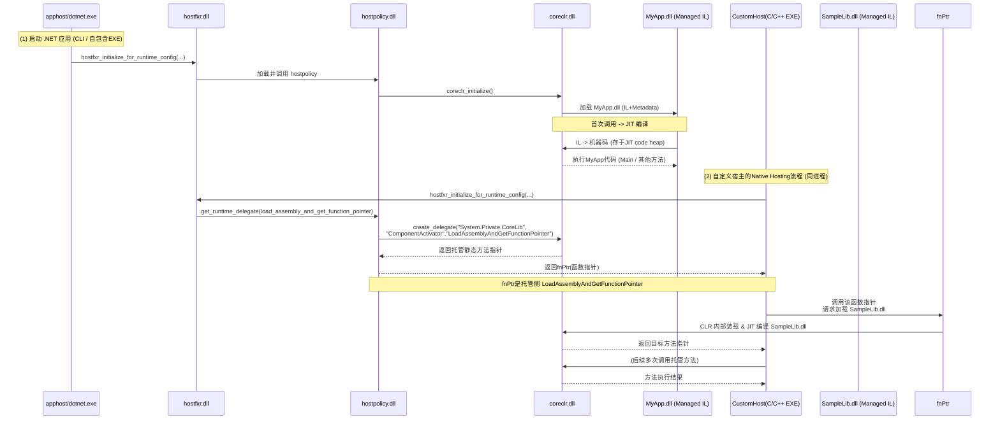
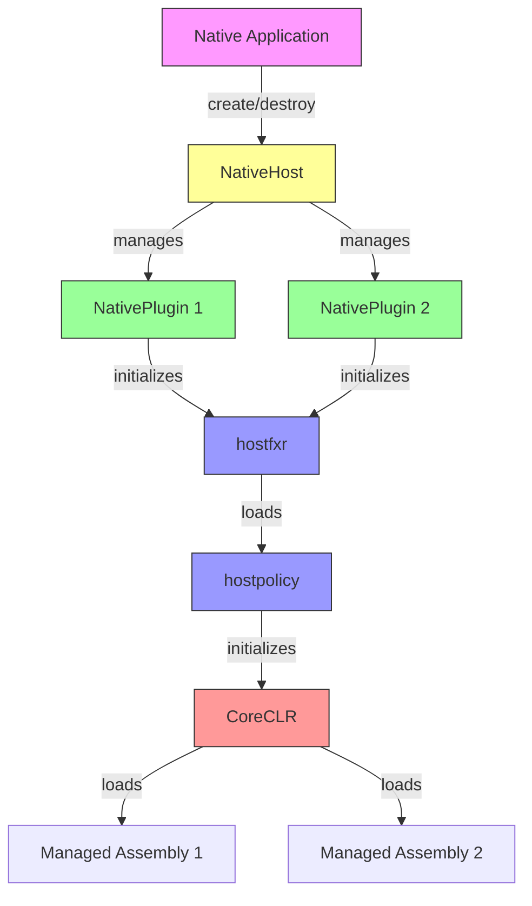

# 使用 .NET Native Hosting 构建 AOT 环境下的 .NET 扩展程序

本文档从应用程序（.NET）的编译、运行切入，系统地介绍了 .net native hosting 技术如何通过一系列组件（如 `apphost`, `hostfxr`, `hostpolicy`, `coreclr`）的协作来达到自定义执行托管程序集，同时也概括了 JIT 与 AOT 场景下的异同及关键原理。文档后半部分也对托管类型在 CLR 内部的表示方式（MethodTable / TypeHandle）做了概括性说明。概述：从启动到执行

一个 .NET 应用程序（无论是命令行 `dotnet MyApp.dll`，还是自包含 EXE，或自定义 Native Hosting）在启动时，会先由**宿主**进程/可执行载入，再通过 `.NET Hosting` 相关的原生库（hostfxr / hostpolicy）协调加载 `.NET Runtime`（coreclr），最后再把我们的托管程序集（.NET Assembly）载入并执行。

在典型的 .NET 6+ 单文件或自包含部署里，一些组件会被打包到同一个可执行文件中，流程本质类似，但物理文件整合在一起。

## 关键组件与角色

### apphost

- **apphost** 是一种生成好的原生启动器（exe），由 .NET SDK 在发布阶段生成。
- 当你发布自包含的 .NET 应用程序（`dotnet publish -r <rid> -p:PublishSingleFile=true`）时，SDK 会把 `hostfxr`、`hostpolicy` 等打包进最终的单文件 exe（这也是"apphost"）。用户双击该 exe，就相当于先启动了原生主程序，再进入到后续的 .NET runtime 初始化流程。

### hostfxr

- **hostfxr**（如 `hostfxr.dll` / `.so`）是最外层的 Hosting API 库，它负责：

  1. **解析** 应用的 `.runtimeconfig.json`、.NET 版本、依赖信息；
  2. **定位并加载** `hostpolicy`；
  3. 向外暴露一组"Native Hosting API"（如 `hostfxr_initialize_for_runtime_config`、`hostfxr_get_runtime_delegate`），方便自定义宿主调用。

- 在"命令行执行"场景里，是 `dotnet.exe` 先加载 `hostfxr` 并调用其初始化逻辑。

### hostpolicy

- **hostpolicy**（如 `hostpolicy.dll` / `.so`）是宿主策略库，它承接 `hostfxr` 的调用，进一步负责：
  - 读取并处理 **依赖解析**（依赖 `.deps.json` 里的信息）
  - **启动 coreclr**：加载并初始化 .NET runtime
  - 暴露出若干内部枚举和接口（如 `coreclr_delegate_type`）给 `hostfxr` 及上层宿主用，用于获取特定的 runtime 委托（delegate）
- 在源代码层面可见 [hostpolicy.cpp](https://github.com/dotnet/runtime/blob/main/src/native/corehost/hostpolicy/hostpolicy.cpp) 展示了它如何处理不同类型的 delegate 请求，如 `load_assembly_and_get_function_pointer`。

### coreclr

- **coreclr**（如 `coreclr.dll` / `.so`）是 .NET 的真正运行时引擎，包含 **JIT**、**GC**、**类型系统**、**线程管理** 等。
- 对宿主层暴露一些 API（例如 `ICLRRuntimeHost2::CreateDelegate`）来动态获取托管方法的原生调用入口点，或执行托管程序集的 `Main` 方法。
- 在 .NET 5+ 统一 branding 下，也称 `.NET runtime`。底层仍是 CoreCLR。

### managed assembly

- **托管程序集**（.dll / .exe）指我们用 C# 或其他 .NET 语言编译出的 IL+元数据文件。
- 最终在 .NET runtime（coreclr）下 JIT 或 AOT 执行。

## 应用程序生命周期：启动流程与模块协作

下面以 **JIT 场景** 的 .NET 应用为例（最常见）：

1. **用户启动应用**（双击 EXE 或命令行 `dotnet MyApp.dll`）
2. **apphost / dotnet.exe 加载 `hostfxr`**
   - `hostfxr` 读取 `.runtimeconfig.json`，确定 .NET 版本和路径
   - 加载 `hostpolicy` 并调用其初始化接口
3. **hostpolicy 初始化并解析依赖**
   - 读取 `.deps.json` 信息，确定要加载的托管程序集列表和 probing 路径
   - `hostpolicy` 加载并初始化 `coreclr`
4. **coreclr 启动，加载入口程序集**
   - 根据托管程序集的 `Main()`（或宿主指定的方法指针）开始执行
   - 当方法第一次被调用时，JIT 编译 IL 到机器码
5. **运行时执行**
   - .NET 应用逻辑开始运行，CLR 管理 GC、异常处理等，直至进程退出。

**主线思路**就是：宿主(原生进程) -> `hostfxr` -> `hostpolicy` -> `coreclr` -> 加载并执行 managed assembly。




## Native Hosting 与 `create_delegate`

### `load_assembly_and_get_function_pointer` 简述

在"自定义宿主"场景里（也称 **Native Hosting**），我们可能直接用 C/C++ 自己写一个 EXE，然后调用 `hostfxr` API 来手动控制 runtime。流程通常是：

1. **调用 `hostfxr_initialize_for_runtime_config`**
   - 传递 `.runtimeconfig.json` 或者手动提供 runtime 目录信息。
2. **获取指定类型的委托**（枚举类型 `coreclr_delegate_type`）
   - 例如 `load_assembly_and_get_function_pointer`：
     ```cpp
     // hostpolicy.cpp 的对应逻辑
     case coreclr_delegate_type::load_assembly_and_get_function_pointer:
         return coreclr->create_delegate(
             "System.Private.CoreLib",
             "Internal.Runtime.InteropServices.ComponentActivator",
             "LoadAssemblyAndGetFunctionPointer",
             delegate);
     ```
   - 这里 `create_delegate` 会拿到托管方法 `ComponentActivator.LoadAssemblyAndGetFunctionPointer` 的原生函数指针。
3. **调用该函数指针**
   - 这个托管方法内负责加载指定的 .NET assembly 并获取其中某个方法指针，再返回给原生层。
   - 整个过程保持在**同一个进程**中，CoreCLR 与原生宿主通过函数指针互操作。

**核心**：`hostpolicy` 并没有直接调用 CLR 内部私有 API 去加载程序集，而是通过托管公共入口点（`System.Private.CoreLib` 内的静态方法）来实现。这样保持了模块分层清晰和可维护性。

## 托管代码执行机制：JIT & AOT

### JIT (Just-In-Time)

- **编译时**：托管程序集以 IL+元数据形式存在。
- **运行时**：当方法第一次调用时，CoreCLR 内部的 JIT 编译器把 IL 转成机器码，存入内存中的"JIT code heap"。
- **调用约定统一**：CoreCLR 的 C++ 原生代码与 JIT 生成的机器码在同一进程内协同，通过函数指针和共享的 runtime 数据结构（MethodDesc, MethodTable 等）进行交互。

### AOT (Ahead-Of-Time)

- 在编译/发布阶段，就将 IL 编译成原生机器码，可能与 `.NET runtime` 一起打包进一个可执行或库文件中。
- 运行时不再需要 JIT，但仍然需要 CLR 的 GC、类型系统、异常处理等服务。
- **NativeAOT** 或 **ReadyToRun**（Crossgen2）等方案，都属于 AOT 的具体实现方式。
- **相同点**：最终还是在同一个 runtime 环境中执行（只是不再即时编译 IL）。


## Native Plugin Host 实现详解

### 架构概览

在我们的实现中，主要包含以下几个核心组件：

1. **NativeHost**：顶层宿主管理器
   - 管理多个插件实例的生命周期
   - 提供插件的创建、查找和销毁功能
   - 通过不透明句柄（opaque handle）维护插件映射关系

2. **NativePlugin**：单个插件实例
   - 封装单个 .NET 运行时实例
   - 管理 hostfxr 相关的函数指针
   - 处理程序集加载和方法调用

3. **原生 API 层**：C 接口
   - 提供跨平台的 C API
   - 处理错误码和状态管理
   - 实现资源的安全释放

### 组件关系图



### NativeHost

`NativeHost` 类是整个插件系统的核心管理器，它与前文提到的 .NET hosting 组件的关系如下：

1. **与 apphost 的关系**
   - 不同于 apphost 作为启动器，`NativeHost` 是一个库形式的宿主
   - 允许现有原生应用程序动态加载 .NET 功能

2. **与 hostfxr 的交互**
   - 通过 `NativePlugin` 实例初始化 hostfxr
   - 获取并保存关键的运行时函数指针
   - 管理 hostfxr 的生命周期

3. **内部实现**
```cpp
class NativeHost {
    // 插件实例映射表
    std::unordered_map<native_assembly_handle_t, std::unique_ptr<NativePlugin>> plugins;
    
    // 插件管理方法
    NativePlugin* get_plugin(native_assembly_handle_t handle);
    native_assembly_handle_t add_plugin(std::unique_ptr<NativePlugin> plugin);
    bool remove_plugin(native_assembly_handle_t handle);
};
```

### NativePlugin

`NativePlugin` 类代表单个 .NET 运行时实例，它负责：

1. **运行时初始化**
   - 加载 hostfxr 库
   - 初始化运行时配置
   - 获取程序集加载函数指针

2. **方法调用桥接**
   - 加载托管程序集
   - 获取特定方法的函数指针
   - 提供原生代码调用托管方法的能力

3. **内部实现**
```cpp
class NativePlugin {
    // 核心函数指针
    load_assembly_and_get_function_pointer_fn load_assembly_and_get_function_ptr;
    hostfxr_close_fn hostfxr_close_ptr;
    
    // 状态管理
    bool is_initialized;
};
```

### 错误处理机制

实现提供了细粒度的错误码系统：

```cpp
typedef enum {
    // 成功代码（0和正值）
    native_host_SUCCESS = 0,

    // 宿主错误（-100到-199）
    native_host_ERROR_HOST_NOT_FOUND = -100,

    // 插件错误（-200到-299）
    native_host_ERROR_PLUGIN_NOT_FOUND = -200,
    
    // 运行时错误（-300到-399）
    native_host_ERROR_RUNTIME_INIT = -300,
    
    // 程序集错误（-400到-499）
    native_host_ERROR_ASSEMBLY_LOAD = -400,
    
    // 通用错误（-500到-599）
    native_host_ERROR_INVALID_ARG = -500,
} NativeHostStatus;
```

### 托管侧 PluginHost 设计

`PluginHost` 类是 Native Plugin Host 的托管侧包装器，它提供了与原生 API 对应的托管方法：


## PluginHost 使用指南

### 基本概念

`PluginHost` 是 Native Plugin Host 的托管侧包装器，它提供了一个简单直观的 API 来管理多个 .NET 插件。每个插件都有自己独立的运行时配置和生命周期。`Plugin` 类封装了单个插件实例的状态和行为，包括委托缓存和资源管理。

### 插件生命周期

1. **创建宿主**
```csharp
// 创建宿主实例，它会负责管理所有插件
using var pluginHost = new PluginHost();
```

2. **加载插件**
```csharp
// 准备插件配置路径
var runtimeConfigPath = Path.Combine(baseDir, "MyPlugin.runtimeconfig.json");

// 加载插件并获取插件实例
using var plugin = pluginHost.LoadPlugin(runtimeConfigPath);
Console.WriteLine($"Loaded plugin: {plugin.Handle}");
```

3. **获取函数**
```csharp
// 定义委托类型
delegate int CalculationDelegate(int a, int b);

// 获取函数委托（会自动缓存）
var add = plugin.GetFunction<CalculationDelegate>(
    "MyPlugin.dll",        // 程序集路径
    "MyPlugin.Calculator", // 类型名称
    "Add"                  // 方法名称
);

// 调用函数
int result = add(10, 20);
```

4. **清理资源**
```csharp
// 使用 using 语句自动释放插件资源
// 或者显式调用 Dispose
plugin.Dispose();
```

### 多插件管理示例

```csharp
using var pluginHost = new PluginHost();

try
{
    var baseDir = AppContext.BaseDirectory;
    
    // 加载计算器插件
    var calculatorConfigPath = Path.Combine(baseDir, "Calculator.runtimeconfig.json");
    var calculatorAssemblyPath = Path.Combine(baseDir, "Calculator.dll");
    var calculatorTypeName = "Calculator.Math, Calculator";
    
    using var calculator = pluginHost.LoadPlugin(calculatorConfigPath);
    
    // 获取计算器函数
    var add = calculator.GetFunction<Func<int, int, int>>(
        calculatorAssemblyPath,
        calculatorTypeName,
        "Add"
    );
    
    // 加载日志插件
    var loggerConfigPath = Path.Combine(baseDir, "Logger.runtimeconfig.json");
    var loggerAssemblyPath = Path.Combine(baseDir, "Logger.dll");
    var loggerTypeName = "Logger.FileLogger, Logger";
    
    using var logger = pluginHost.LoadPlugin(loggerConfigPath);
    
    // 获取日志函数
    var log = logger.GetFunction<Action<string>>(
        loggerAssemblyPath,
        loggerTypeName,
        "Log"
    );
    
    // 使用插件
    int sum = add(5, 3);
    log($"计算结果: {sum}");
    
    // 使用 using 语句自动清理资源
}
catch (Exception ex)
{
    Console.WriteLine($"Error: {ex.Message}");
    if (ex.InnerException != null)
    {
        Console.WriteLine($"Inner Error: {ex.InnerException.Message}");
    }
}
```

### Plugin 类功能

1. **委托缓存**
```csharp
// 首次调用时获取并缓存委托
var add = plugin.GetFunction<CalculationDelegate>(assemblyPath, typeName, "Add");

// 再次调用时直接从缓存返回
var cachedAdd = plugin.GetFunction<CalculationDelegate>(assemblyPath, typeName, "Add");
```

2. **缓存管理**
```csharp
// 清除委托缓存
plugin.ClearCache();
```

3. **状态检查**
```csharp
// 获取插件句柄
IntPtr handle = plugin.Handle;

// 获取运行时配置路径
string configPath = plugin.RuntimeConfigPath;
```

### 插件开发指南

1. 创建新的 .NET 类库项目
   
```xml
<Project Sdk="Microsoft.NET.Sdk">
  <PropertyGroup>
    <TargetFramework>net8.0</TargetFramework>
    <GenerateRuntimeConfigurationFiles>true</GenerateRuntimeConfigurationFiles>
    <EnableDynamicLoading>true</EnableDynamicLoading>
  </PropertyGroup>
</Project>
```

- **项目配置说明**：

  - `TargetFramework`: 指定目标框架版本。
  - `GenerateRuntimeConfigurationFiles`: 生成 `.runtimeconfig.json` 文件，该文件包含运行时配置信息，是插件加载所必需的。
  - `EnableDynamicLoading`: 启用动态加载支持，允许程序集在运行时被动态加载。这会将程序集编译为可重定位的形式，便于插件系统加载。


- **实现插件类**：

   ```csharp
   public class Calculator
   {
      [UnmanagedCallersOnly]
      public static int Add(int a, int b)
      {
         return a + b;
      }
   }
   ```

- **参数类型限制**
   - 使用 `UnmanagedCallersOnly` 特性的方法必须遵循以下规则:
     - 必须是 `static` 方法
     - 返回类型必须是 `void` 或 blittable 类型
     - 参数类型必须是 blittable 类型
     - 不能有泛型参数
     - 不能使用 `params` 关键字
     - 不能使用 `in`、`out` 或 `ref` 修饰符

   示例:
   ```csharp
   // ✅ 正确 - 基本数值类型
   [UnmanagedCallersOnly]
   public static int Add(int a, int b) => a + b;

   // ✅ 正确 - 指针类型
   [UnmanagedCallersOnly]
   public static unsafe void* GetBuffer(int size) => /* ... */;

   // ❌ 错误 - 非静态方法
   [UnmanagedCallersOnly]
   public int Multiply(int a, int b) => a * b;

   // ❌ 错误 - 非 blittable 类型
   [UnmanagedCallersOnly]
   public static string GetName() => "test";

   // ❌ 错误 - 泛型参数
   [UnmanagedCallersOnly]
   public static T GetValue<T>() => default;

   // ❌ 错误 - ref 参数
   [UnmanagedCallersOnly]
   public static void Update(ref int value) => value++;
   ```

## 总结

本文详细介绍了 .NET Native Hosting 的基本原理，以及我们基于这些原理实现的插件系统。通过 `NativeHost` 和 `NativePlugin` 的协作，我们提供了一个灵活、安全且高效的方案，让原生应用程序能够方便地集成和使用 .NET 功能。

## 参考链接 & 示例位置

1. **dotnet/runtime 源码仓库**

   - [dotnet/runtime/blob/main/src/native/corehost/hostpolicy/hostpolicy.cpp](https://github.com/dotnet/runtime/blob/main/src/native/corehost/hostpolicy/hostpolicy.cpp)
     - 包含 `coreclr_delegate_type` 相关逻辑及 `create_delegate` 示例。

2. **Native Hosting 示例**

   - https://github.com/dotnet/samples/tree/main/core/hosting
     - 演示如何在原生代码中使用 `hostfxr` / `hostpolicy` 来初始化 .NET runtime 并调用托管方法。

3. **ComponentActivator.LoadAssemblyAndGetFunctionPointer 源码**

   - [System.Private.CoreLib/src/Internal/Runtime/InteropServices/ComponentActivator.cs](https://github.com/dotnet/runtime/blob/main/src/libraries/System.Private.CoreLib/src/Internal/Runtime/InteropServices/ComponentActivator.cs)
     - 托管侧静态方法，用于在 Native Hosting 场景中加载指定程序集并获取方法指针。

4. **CoreCLR / MethodTable, EEClass, JIT**
   - [dotnet/runtime/blob/main/src/coreclr/](https://github.com/dotnet/runtime/tree/main/src/coreclr) 目录
   - 内含 CLR 的 GC、JIT、类型系统等实现细节。

5. **更多资料**
   - [.NET Docs: Writing a custom .NET host (Native Hosting)](https://docs.microsoft.com/dotnet/core/tutorials/netcore-hosting)

